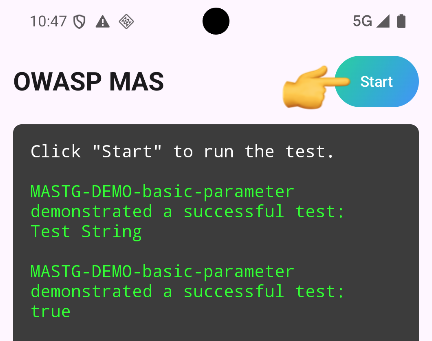

# Development / Local Testing

This document describes how to set up a local development environment for the repository on macOS.

## Prerequisites

- Python 3+ (use `python3`)
- Node.js (LTS) and `npm` or `pnpm` for JS tooling (optional)
- A physical device or emulator with `frida-server` for rooted testing (common for Android)
- Frida Gadget only for jailed/non-root scenarios

## Running the CLI locally

1. **Create a new Python virtual environment and activate it**

    ```bash
    python3 -m venv venv
    source venv/bin/activate
    ```

2. Compiling the frooky agent:

    ```bash
    ./compileAgent.sh --dev
    ```

3. **Install the CLI for development**

    ```bash
    pip install -e .
    ```

4. **Ensure which CLI version you're running**

    ```bash
    which frooky
    ```

   The output must be a path within the VENV directory, typically ending with `venv/bin/frooky`. If not, a different version might be used instead, such as a global installation.

## Testing

The project consists of two testable components: a Frida agent written in TypeScript and a Python host.

The agent has its own dedicated unit tests that run directly on a target device, as the agent's functionality is  tied to the runtime environment Frida operates in.

The host, on the other hand, serves as an integration test for the full application.

The following chapters describe how to write tests and target apps the tests should run against.

### Building and Installing Target App

Tests usually require a target app which implements the feature that should be tested.

You find them in the folder `tests/target-apps`, together with [instructions](../tests/target-apps/README.md) how to build them.

After building, the app must be installed manually on the device or simulator before running tests. 

> [!NOTE]
> Before proceeding, make sure Frida is available on the target device (Android) or on the local machine (iOS Simulator).

### Running Host Tests

These tests are related to the frooky host.  Tests are implemented with pytest and live under `tests/`. They can be unit tests for the Python code, or integration tests, if you want to test the functionality end-to-end.

#### Developing and Running Host Unit Tests

The unit tests are located in `tests/unit`. They usually _don't_ require a target app, since they directly test Python code without the need to interact with a remote target.

Run them using the following command:

```sh
pytest tests/unit
```

Write new tests using the official [`ptyest` documentation](https://docs.pytest.org/en/stable/).

#### Developing and Running Host Integration Tests

These tests often require a target device an a target app. Build and install them first according to their [documentation](../tests/target-apps/README.md)

Run them all using the following command:

```sh
pytest tests/integration
```

If you only want to run them fro a certain platform use:

```sh
pytest tests/integration/android
pytest tests/integration/ios
```

Since these integration test are the most complex one, lets have a look at the anatomy of one test:

```python
 def test_single_method(self, run_frooky, count_matched_events):
     """Test hooking a single Java method in a real process."""

     hook_file = {
         "category": "STORAGE",
         "hooks": [
             {
                 "class": "androidx.security.crypto.EncryptedSharedPreferences$Editor",
                 "methods": [
                     "putString"
                 ]
             }
         ]
     }

     target_app = "mastg-demo-0060"

     run_frooky(hook_file, target_app)

     expected_pattern = {
         "class": "androidx.security.crypto.EncryptedSharedPreferences$Editor",
         "method": "putString",
     }

     assert count_matched_events(
         expected_pattern) == 2, "Not the amount of expected matched events found."
```

The magic happens mostly in `run_frooky(hook_file, target_app)`. This will do the following:

1. Run the `target_app` located in `tests/target-apps/<android|ios>/mastg-demo-0060` (make sure it is installed).
2. Write the data in `hook_file` to a temporary `hook_file.yaml`
3. Start frooky and attach to the `target_app`. The output file is located at `output.json`
4. Using [maestro](https://maestro.dev/) to automatically click the "Start" button and run the MAS DEMO:

   

After this function completes, we can access the file `output.json` and verify if it contains the expected results. This is done in the function `count_matched_events()` which tests if the actual produced output from the `output.json` file contains the subset defined in `expected_pattern`.

> [!TIP]
> Try to reuse the already existing target apps located in [`tests/target-apps`](../tests/target-apps/) before implementing new ones.

### Running Agent Tests

The Frida agent has its own test suite that runs inside a live Frida session (on a real device, simulator, or emulator). Tests are written in TypeScript and live under `frooky/agent/tests/`.

All test commands must be run from the `frooky/agent/` directory with Node.js dependencies installed:

```bash
cd frooky/agent
npm ci
```

You only need to do this once (or after updating `package-lock.json`).

In general, you need to have either the PID (attach), bundle-id (spawn then attach), or app name (attach by name).

#### Option A: USB Device (Android and iOS)

Use this when the app is running on a device connected over USB with `frida-server` running on the device (or with a Frida gadget embedded in the app).

```bash
# Examples: Target is an physical or emulated Android:
npm run test:android -i org.owasp.mastestapp
npm run test:android -i MASTestApp
npm run test:android -i 4926

# Examples: Target is a physical iOS USB device mode:
npm run test:ios:usb -i org.owasp.mastestapp.MASTestApp-iOS
npm run test:ios:usb -i MASTestApp
npm run test:ios:usb -i 23452
```

#### Option B: Local (iOS Simulator only)

Use this when targeting an **iOS Simulator** on your Mac via the local device.

Compared to option A, this differs, because the target app in an iOS simulator is running as local process on the host system. This means, that there is no need to start a dedicated Frida server.

Use the following commands to test against the running simulator:

```bash
# Examples: Target is an physical or emulated Android:
npm run test:android:usb -i org.owasp.mastestapp
npm run test:android:usb -i MASTestApp
npm run test:android:usb -i 4926

# Examples: Target is a iOS simulator:
npm run test:ios:local -i org.owasp.mastestapp.MASTestApp-iOS
npm run test:ios:local -i MASTestApp
npm run test:ios:local -i 23452
```

### What the Tests Do

Each test script:

1. Builds the agent and the test agent bundle (`dist/agent-test-{platform}.js`).
2. Attaches to (or spawns) the target app via Frida.
3. Injects the test bundle into the live process.
4. The bundle runs all registered `test(...)` cases inside the process and sends results back.
5. Results are printed to the terminal; the process exits with code `0` (all pass) or `1` (any failure).

### Test File Structure

```sh
frooky/agent/tests/
├── agent-test-framework.ts   # Minimal test runner (test/expect API)
├── target-apps/              # Folder of apps in the form of MASTG-DEMO apps
├── android/
│   ├── agent-runner.ts       # Entry point injected into the Android app
│   └── test-*.ts             # Tests
└── ios/
    ├── agent-runner.ts       # Entry point injected into the iOS app
    └── test-*.ts             # Tests
```

To add a new test, create a `test-*.ts` file in the relevant platform folder and import it in `agent-runner.ts`.
