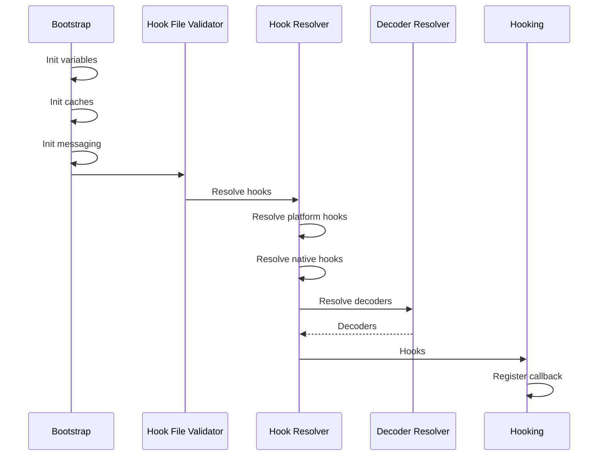
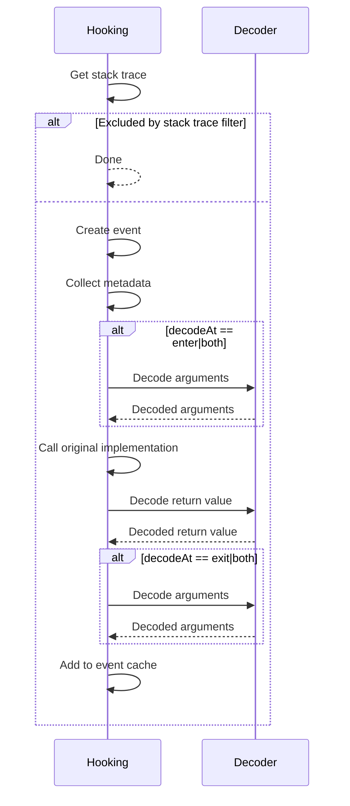
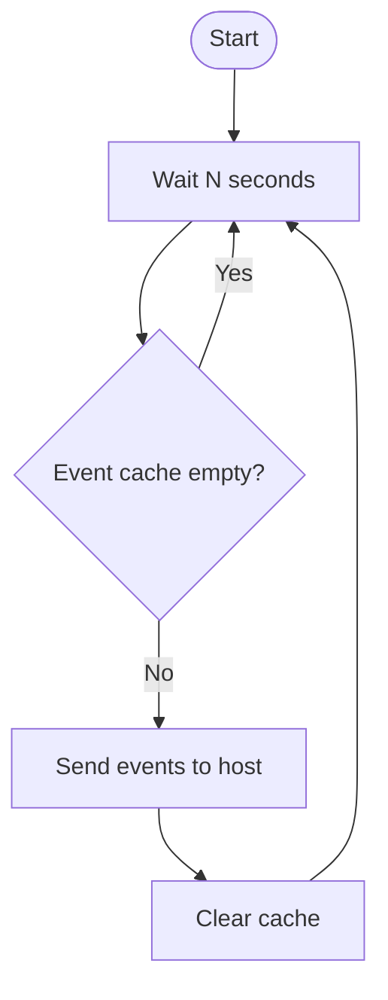

# Architecture

This document describes the architecture of the frooky agent. The frooky agent is made up from the following components:

1. Bootstrap
1. Hook File Validator
1. Hook Resolver
1. Decoder Resolver
1. Decoder
1. Hooking
2. Event Sender

## Start of frooky: Initializing and Hooking the Target Functions/Methods

The following graph shows what happens, when we start a frooky agent:

Here the responsibilities for the different components:

1. **Bootstrap**  
    Initializes variables, caches and the messaging system. 
    
    The code is shared between all platforms.

1. **Hook File Validator**  
    Validates the syntax and the semantic of the JSON. For example, a hook for `Android` should raise an error when run on an `iOS` target.

    The validator creates the datastructure passed to the hook lookup component. 

    The code is shared between all platforms.

1. **Hook Resolver**  
    Does the lookup of the target function or method. 

    This depends on the platform. Android, iOS both have their own implementation of the hook lookup for platform hooks (Java and Objective-C).

    The native lookup is shared between all platforms.

1. **Decoder Resolver**  
    If the hook contains a type, frooky will check, if an internal decoder for this type exists. If a custom decoder is specified, frooky will load it.

    The decoder is then stored in the hook structure for faster access when the hook fires.

1. **Hooking**  
   The target function is actually hooked.
   
   This depends on the platform. Android, iOS both have their own implementation of the hook lookup for platform hooks (Java and Objective-C).

   The native lookup is shared between all platforms.

   Once all hooks are set up, the hooking is complete.

## Handling a Hooked Function/Method

The following graph shows what happens, once a registered hook is fired:

Here the responsibilities for the different components:

1. **Hooking**  
    Implement the code run when a function or method is hooked. This code replaces the actual implementation, but does not change anything in the code flow.

    This depends on the platform. Android, iOS both have their own implementation of the hook lookup for platform hooks (Java and Objective-C).

    The native lookup is shared between all platforms.

1. **Decoder**  
    Implements how the different types are actually decoded.     
    
    This depends on the platform. Android, iOS both have their own implementation of the hook lookup for platform hooks (Java and Objective-C).

    The native lookup is shared between all platforms.

## Event Sender 

The Event Sender periodically checks if the event cache has new events, and sends them to the frooky host if this is the case. Then, the cache is cleared.

The following flowchart shows this process:

